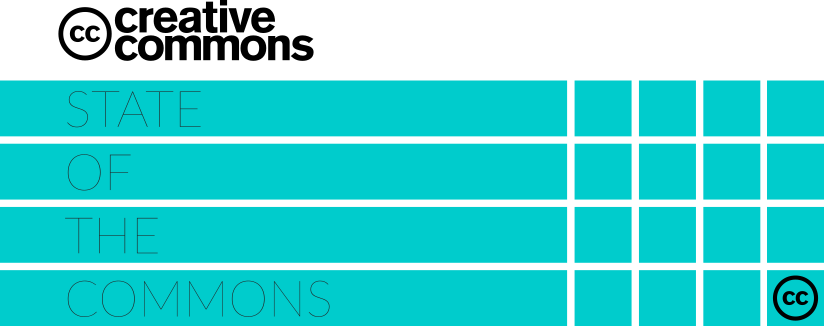
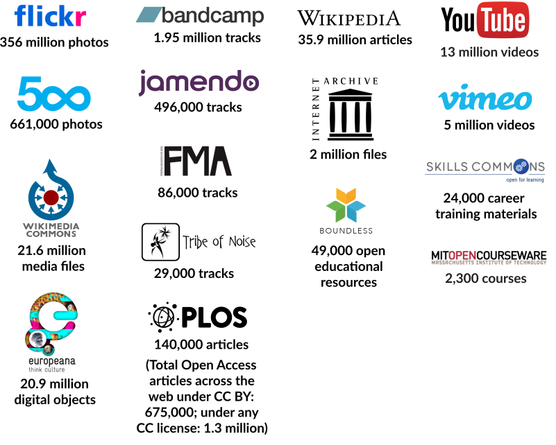
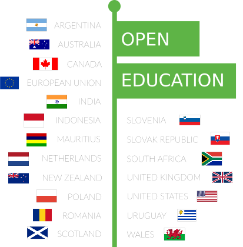
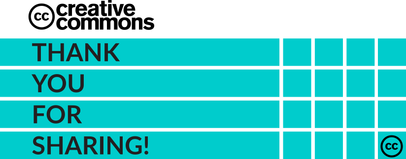

## State  of  the  Commons {.bb}

Collaboration, sharing, and cooperation are a driving force for human
evolution. Creative Commoners have known this fact all along, and
recently there has been a flurry of new research to explain why. We
are hardwired for sharing. Harvard professor on evolutionary dynamics
Martin Nowak calls it the essential "snuggle for survival" -- evidence
that sharing is not just a selfless act. Sharing has concurrent and
lasting benefits, multiplied for the giver, the receiver, and
communities at large.

The online communities that we've created together are a global
platform for sharing. If we want to live in a digital world that is
fair, diverse, vibrant, serendipitous, and safe for everyone, we will
have to choose to make it that way. If that world is going to be
accessible, equitable, and full of innovation and opportunity, it will
require our leadership to foster and defend these ideals. Founded in
2001, Creative Commons has created legal and technical infrastructure
that is fundamental to the Web we know and love. Today, our work goes
beyond the ubiquitous CC licenses to foster cooperation and sharing,
support collaborative communities, and drive engagement across the
spectrum of open knowledge and free culture.

Creative Commons is a global charity, with an powerful affiliate
network of researchers, activists, legal, education and policy
advocates, and volunteers who serve as CC representatives in over 85
countries.  Together, we lead this ever-growing global
movement. Whether it's open education, open data, science, research,
music, video, photography, or public policy, we are putting sharing
and collaboration at the heart of the Web. In doing so, we are much
closer to realizing our vision: unlocking the full potential of the
Internet to drive a new era of development, growth, and productivity.

I am proud to share with you our 2015 State of the Commons report, our
best effort to measure the immeasurable scope of the commons by
looking at the CC licensed content, along with content marked as
public domain, that comprise the slice of the commons powered by CC
tools.  We are proud to be a leader in the commons movement, and we
hope you will join us as we celebrate all we have accomplished
together this year.

Ryan Merkley  
CEO, Creative Commons  
@ryanmerkley

-----

## Wow! Over 1 billion CC licensed works in the Commons in 2015

> CC licensed works have nearly tripled in the last 5 years.

<table class="table table-bordered table-striped">
<thead>
<tr class="header">
<th style="text-align: left;">Total licensed works</th>
<th style="text-align: left;">Year</th>
</tr>
</thead>
<tbody>
<tr class="odd">
<td style="text-align: left;">140 million</td>
<td style="text-align: left;">2006</td>
</tr>
<tr class="even">
<td style="text-align: left;">400 million</td>
<td style="text-align: left;">2010</td>
</tr>
<tr class="odd">
<td style="text-align: left;">882 million</td>
<td style="text-align: left;">2014</td>
</tr>
<tr class="even">
<td style="text-align: left;">1.1 billion</td>
<td style="text-align: left;">2015</td>
</tr>
</tbody>
</table>

CC and its suite of licenses are the global standard for legal
sharing, embedded in major content platforms from Wikimedia to
Europeana, and adopted by foundations and governments from the Bill
and Melinda Gates Foundation to the White House.

---

Note: Data includes content licensed with the full CC license suite,
along with content marked with CC public domain tools. This is a low
bound estimate based on what we could count. Dig into our data
sources.

-----

## More people are choosing to share with "Free Culture" licenses

<table class="table table-bordered table-striped">
<thead>
<tr class="header">
<th style="text-align: left;">License/tool</th>
<th style="text-align: left;">Percentage of works</th>
<th style="text-align: left;">Free Culture License?</th>
</tr>
</thead>
<tbody>
<tr class="odd">
<td style="text-align: left;">CC0, Public Domain Mark + retired PD tool</td>
<td style="text-align: left;">3%</td>
<td>Yes</td>
</tr>
<tr class="even">
<td style="text-align: left;">CC Attribution (CC BY)</td>
<td style="text-align: left;">24%</td>
<td>Yes</td>
</tr>
<tr class="odd">
<td style="text-align: left;">CC Attribution ShareAlike (CC BY SA)</td>
<td style="text-align: left;">37%</td>
<td>Yes</td>
</tr>
<tr class="even">
<td style="text-align: left;">CC Attributon NoDerivs (CC BY ND)</td>
<td style="text-align: left;">2%</td>
<td>No</style>
</tr>
<tr class="odd">
<td style="text-align: left;">CC Attribution NonCommercial (CC BY NC)</td>
<td style="text-align: left;">6%</td>
<td>No</td>
</tr>
<tr class="even">
<td style="text-align: left;">CC Attribution NonCommercial ShareAlike (CC BY-NC-SA)</td>
<td style="text-align: left;">14%</td>
<td>No</style>
</tr>
<tr class="odd">
<td style="text-align: left;">CC Attribution NonCommercial NoDerivs (CC BY NC ND)</td>
<td style="text-align: left;">14%</td>
<td>No</td>
</tr>
</tbody>
</table>

From more open to more restrictive -- less restrictive FREE CULTURE
licenses allow for both commercial use and adaptations.

---

Note: Data includes content licensed with the full CC license suite
and marked with our public domain tools. Dig into our data sources.

-----

## The CC marked public domain has nearly doubled in size over the last 12 months

<table class="table table-bordered table-striped">
<thead>
<tr class="header">
<th style="text-align: left;">Year</th>
<th style="text-align: left;">Retired PD tool</th>
<th style="text-align: left;">Public Domain Mark</th>
<th style="text-align: left;">CC0</th>
<th style="text-align: left;">Total</th>
</tr>
</thead>
<tbody>
<tr class="odd">
<td style="text-align: left;">2006</td>
<td style="text-align: left;">3.2 million</td>
<td style="text-align: left;">-</td>
<td style="text-align: left;">-</td>
<td style="text-align: left;">3.2 million</td>
</tr>
<tr class="even">
<td style="text-align: left;">2014</td>
<td style="text-align: left;">5.7 million</td>
<td style="text-align: left;">1.5 million</td>
<td style="text-align: left;">10.3 million</td>
<td style="text-align: left;">17.5 million</td>
</tr>
<tr class="odd">
<td style="text-align: left;">2015</td>
<td style="text-align: left;">10 million</td>
<td style="text-align: left;">2.6 million</td>
<td style="text-align: left;">22.3 million</td>
<td style="text-align: left;">34.9 million</td>
</tr>
</table>

---

Note: Data includes content under the CC0 public domain dedication and
Public Domain Mark, but not unmarked material in the public
domain. Dig into our data sources.

-----

## In 2015, CC licensed works were viewed online
## 136 billion times {.zomg}

 = 1 Billion

#### CC licensed work is retained, reused, revised, remixed, and redistributed in infinite ways. We captured just a slice of this massively distributed collaboration by measuring the number of times CC licensed work gets accessed from the global pool of content.

---

Note: Data tracks downloads on CC license buttons, or the number of
times CC licensed content was viewed on a web page. Dig into our data
sources.

-----

## Diversity and global visibility

Creative Commons is a truly international movement with active
communities on every continent (yes, even Antarctica). A significant
milestone was the 2013 launch of Version 4.0 and CC's first official
translation policy for internationalizing the license suite. To date,
the 4.0 license suite has been officially translated into 7 languages,
with 3 more to be published in 2015.

## People are sharing with CC licenses in 34 languages with more than 90 million views of CC's deeds in the last 10 years.

<table class="table table-bordered table-striped">
<tbody>
<tr><td class="odd">**(العربية)** (Arabic)</td></tr>
<tr><td class="even">**беларускі** (Belarusian)</td></tr>
<tr><td class="odd">**Català** (Catalan)</td></tr>
<tr><td class="even">**中国** (Chinese*)</td></tr>
<tr><td class="odd">**hrvatski** (Croatian)</td></tr>
<tr><td class="even">**čeština** (Czech)</td></tr>
<tr><td class="odd">**danske** (Danish)</td></tr>
<tr><td class="even">**Nederlands** (Dutch)</td></tr>
<tr><td class="odd">**English** (English*)</td></tr>
<tr><td class="even">**Esperanton** (Esperanto)</td></tr>
<tr><td class="odd">**suomi** (Finnish)</td></tr>
<tr><td class="even">**français** (French*)</td></tr>
<tr><td class="odd">**galego** (Galician)</td></tr>
<tr><td class="even">**Deutsche** (German*)</td></tr>
<tr><td class="odd">**ελληνικά** (Greek)</td></tr>
<tr><td class="even">**Magyar** (Hungarian)</td></tr>
<tr><td class="odd">**bahasa Indones** (Indonesian)</td></tr>
</tbody>
</table>

<table class="table table-bordered table-striped">
<tbody>
<tr><td class="even">**italiano** (Italian)</td></tr>
<tr><td class="odd">**日本語** (Japanese)</td></tr>
<tr><td class="even">**한국어** (Korean)</td></tr>
<tr><td class="odd">**Latvijā** (Latvian)</td></tr>
<tr><td class="even">**Lietuvos** (Lithuanian)</td></tr>
<tr><td class="odd">**Melayu** (Malay)</td></tr>
<tr><td class="even">**te reo Maori** (Maori)</td></tr>
<tr><td class="odd">**norsk** (Norwegian)</td></tr>
<tr><td class="even">**فارسي** (Persian/Farsi)</td></tr>
<tr><td class="odd">**polski** (Polish)</td></tr>
<tr><td class="even">**português** (Portuguese)</td></tr>
<tr><td class="odd">**Română** (Romanian)</td></tr>
<tr><td class="even">**Русский** (Russian)</td></tr>
<tr><td class="odd">**Español** (Spanish*)</td></tr>
<tr><td class="even">**svenska** (Swedish)</td></tr>
<tr><td class="odd">**Türk** (Turkish)</td></tr>
<tr><td class="even">**Український** (Ukrainian)</td></tr>
</tbody>
</table>

---

Note: Data reflects total views of CC deed pages from Jan 1, 2005
through Nov 3, 2015. * Category includes variations on that language
for simplicity, eg. Chinese includes simplified and traditional
Chinese. Dig into our data sources.

-----

## From research to cute cat photos, the Commons offers a treasure trove of content.

<table class="table table-bordered table-striped">
<thead>
<tr class="header">
<th style="text-align: left;">Content type</th>
<th style="text-align: left;">Number of works</th>
</tr>
</thead>
<tbody>
<tr class="odd">
<td style="text-align: left;">Images (photos, artworks)</td>
<td style="text-align: left;">391 million</td>
</tr>
<tr class="even">
<td style="text-align: left;">Open Educational Resources</td>
<td style="text-align: left;">76,000</td>
</tr>
<tr class="odd">
<td style="text-align: left;">Research (journal articles)</td>
<td style="text-align: left;">1.4 million</td>
</tr>
<tr class="even">
<td style="text-align: left;">Audio tracks</td>
<td style="text-align: left;">4 million</td>
</tr>
<tr class="odd">
<td style="text-align: left;">Videos</td>
<td style="text-align: left;">18.4 million</td>
</tr>
<tr class="even">
<td style="text-align: left;">Texts (articles, stories, documents)</td>
<td style="text-align: left;">46.9 million</td>
</tr>
<tr class="odd">
<td style="text-align: left;">Other (multimedia, 3D)</td>
<td style="text-align: left;">23,000</td>
</tr>
</table>

---

Note: Data only reflects media on 16 platforms + Directory of Open
Access Journals, just a slice of all available CC media on the
web. Dig into our data sources.

-----

## CC is everywhere: Millions of websites use CC licenses, including major platforms like Wikipedia and Flickr and smaller websites like your grandma's blog.

<table class="table table-bordered table-striped">
<thead>
<tr class="header">
<th>Platform</th>
<th>Number of works in the commons</th>
</tr>
</thead>
<tbody>
<tr class="odd"><td>Flickr</td><td>356 million photos</td></tr>
<tr class="even"><td>Bandcamp</td><td>1.95 million tracks</td></tr>
<tr class="odd"><td>Wikipedia</td><td>35.9 million articles</td></tr>
<tr class="even"><td>YouTube</td><td>13 million videos</td></tr>
<tr class="odd"><td>Jamendo</td><td>496,000 tracks</td></tr>
<tr class="even"><td>500px</td><td>661,000 photos</td></tr>
<tr class="odd"><td>Vimeo</td><td>5 million videos</td></tr>
<tr class="even"><td>Internet Archive</td><td>2 million files</td></tr>
<tr class="odd"><td>FMA</td><td>86,000 tracks</td></tr>
<tr class="even"><td>Wikimedia Commons</td><td>21.6 million media files</td></tr>
<tr class="odd"><td>Tribe of Noise</td><td>29,000 tracks</td></tr>
<tr class="even"><td>PLOS</td><td>140,000 articles*</td></tr>
<tr class="odd"><td>Europeana</td><td>20.9 million digital objects</td></tr>
<tr class="even"><td>Skills Commons</td><td>24,000 career training materials</td></tr>
<tr class="odd"><td>Boundless</td><td>49,000 open educational resources</td></tr>
<tr class="even"><td>MIT opencourseware</td><td>2,300 courses</td></tr>
</tbody>
</table>

(* Total Open Access articles across the web under CC BY, 675,000; under any CC license 1.3 million)

> In 2015, more platforms added CC license options for their users,
> including Medium and edX, with Flickr adding support for CC0 and the
> Public Domain Mark. Expect growth on these platforms in 2016.

## ...and many more!

---

Note: Data reflects total CC licensed works on each platform, only 16 websites out of millions. Dig into our data sources.

-----

## 2015 Impact: CC + Open Education {.impact}

CC is at the very heart of the open education movement; our licenses
put the "open" in Open Educational Resources (OER). CC and our open
education partners are leading an international OER campaign to make
it easy for educators and students around the world to freely share
curriculum, textbooks and research at near zero cost. CC is also
helping governments add open licensing requirements on publicly funded
educational resources.

### Countries with Open Education Policies {.by}

Countries with legislation, policies, or funder mandates at the
national, provincial/state, or institutional level that lead to the
creation, increased use, or support for improving OER.

### Open Textbooks have saved students {.by}

### with an additional $53 million projected through academic year 2015/16 {.by .by-r}

---

Note: *European Union is a collection of member states but included in
this country list for reporting purposes; Data reflects savings for
students in Canada and the United States; Data provided by the open
education community. Dig into our data sources.

-----

## 2015 Impact:  CC + Foundation Open Policy {.impact .img-policy}

CC continues to lead the way in advocating for major philanthropic
foundations to adopt open licensing policies. Foundations can
exponentially expand the impact and reach of their grantmaking through
a "default open" policy that ensures that all grantees openly license
any digital outputs of their work, an important shift that has a
tremendous ripple effect.

### In 2015, the following major foundations adopted open policies: {.by}

## These foundations set their default to open from closed, collectively granting approximately $1.9 billion in 2015.

-----

## 2015 Impact: CC + Cultural Heritage {.impact}

Creative Commons has fundamentally changed the way the world can
share, use, and preserve our cultural heritage now and generations to
come.

#### Museums and cultural institutions are choosing to share every day. {.img-frame}

###### Over 50 cultural institutions have made their permanent collections or records available for unrestricted use around the world under CC licenses or public domain tools, including: {.by}

#### Thanks to CC's public domain tools, digital images of outer space are made freely accessible and more broadly available to the public than ever before. {.img-pdmoon}

###### A collaboration with NASA, the Project Apollo Archive makes available thousands of images of the iconic Apollo moon missions of the late 1960s and early 1970s under the Public Domain Mark. {.by}

###### SpaceX, a private corporation, dedicates its photos to the public domain using CC0. {.by}

#### #FREEBASSEL: Lead of Creative Commons Syria, Bassel Khartabil is a key contributor to projects that digitize, preserve, and share cultural heritage. He has been illegally imprisoned in Syria since March 2012. CC and its Board of Directors continue to call for Bassel's immediate and safe release. {.img-bk}

###### Building on his invaluable contributions to the commons, Bassel's #NEWPALMYRA project features the 3D models of the ancient ruins of Palmyra, one of Syria's greatest archaeological treasures. The online community platform and data repository is dedicated to the preservation and creative reuse of data about Palmyra. {.by}

-----

## 2015 Impact: Regional Highlights {.impact}

Creative Commons Affiliate Network includes over 500 researchers,
activists, legal, education and policy advocates, and volunteers who
serve as CC representatives in over 85 countries. Working alongside
non-governmental institutions, universities, and public agencies, CC
affiliates employ region-specific approaches to copyright and intellectual
property that help solve local and global challenges. CC affiliates impact
the growth and quality of the commons across all sectors from education,
science, and research, to cultural heritage, data, design, and hardware.

### Middle East and North Africa {#regional-mideast}

* CC affiliates from across the Middle East and North Africa gather in
two historic meetings to restructure, build capacity, share best
practices, and officially translate the latest version of the CC
license suite into Arabic.

* Al Jazeera English integrates CC licensed interactive material and
infographics from Al Jazeera Labs, including an Arabic translation of
the The Data Journalism Handbook.

### Africa  {#regional-africa}

* South Africa publicly releases 17 years of parliamentary files under
CC BY, including bills, documents, and audio recordings.

* CC African Affiliates and WikiAfrica launch the 2nd annual Wiki
Loves Africa campaign successfully crowdsourcing more than 9,000 CC
licensed images covering African fashion and design.

* Affiliates team up with local partners, the African Storybook
Project and Book Dash to provide CC licensed children's books in 62
African languages across Kenya, Uganda, Lesotho and South Africa.

### Europe {#regional-europe}

* CC Portugal launches a "CC Toolkit for Business" outlining 6
economic benefits of using CC licenses.

* CC affiliates across Europe collaborate with national lawmakers to
implement the European Union's Directive on Collective Rights
Management. The directive requires collecting societies to allow their
members to self-license their works under noncommercial terms,
providing CC musicians with more control over how to share and manage
their music.

### Asia-Pacific {#regional-asia}

* CC Korea hosts Creative Commons' 2015 Global Summit in Seoul,
featuring workshops, panels, and special keynotes by Kilnam Chon, Julia
Reda, Lawrence Lessig, and more.

* Chinese speaking affiliates collaborate across cultures and time
zones to prepare for the official translation of the 4.0 license suite.

### North America {#regional-northamerica}

* The Museum of Modern Art (MoMA) in New York welcomes the CC
logo into its permanent collection, featuring it alongside the @ symbol
and the International Symbol for Recycling in the exhibit, "This Is for
Everyone: Design Experiments for the Common Good."

* Grantees of U.S. Department of Labor's $2 billion career training
program contribute their first round of OER to the Skills Commons
platform under CC BY.

### Latin America {#regional-latinamerica}

* CC Latin America's mini-grants program, now in its second year,
awarded funds to kick off new affiliate projects in El Salvador, Costa
Rica, and Paraguay, including a digital scanner for educational
institutions to provide online access to resources; a free digital
newsletter covering CC topics for Central America; and a mobile
application featuring basic information about CC licenses.

* CC Uruguay translates the Open Licensing Policy Toolkit into
Spanish to encourage Latin American governments to create, adopt and
implement open policies.

-----

## Thank You For Sharing! {.bb}

It's been a remarkable year, most notably for the more than 1.1 billion
works under one of the CC licenses, CC0, or the public domain mark.
CC licenses offer an elegant solution; a release valve to the constraints
of copyright. But it's much bigger than that: Creative Commons has
become a steward of our global commons, a universe of openly-licensed
content that has the power to spark everyday ideas and solve global
challenges. We've unlocked the door to an alternate reality of free and
open content, powered by millions of creators who share our values.

But the key challenge facing the commons today isn't quantity -- it's
usability, vibrancy, and collaboration. Today's web is social and
interconnected, and it has completely changed the way we share, tell
stories, and build communities. While integral to many kinds of creativity
and sharing, Creative Commons has yet to fully activate the content and
creators in our movement. We need our contributors to be able to talk
to each other, find new content, give feedback, offer gratitude, get
analytics, and build networks around the content they are creating. We
need to light up the global commons.

We hope you'll join us and help build a more creative, free, and open
commons. Together we'll be much closer to realizing our vision:
unlocking the full potential of the Internet to drive a new era of
development, growth, and productivity.

Thank you to our Creative Commons Affiliate Network who work
tirelessly everyday to protect and enrich the commons. We also owe
our thanks to Google and the many CC platforms, partners, institutions,
and individuals from the broader open web community who contributed
the essential data and information for this report. Simply put, our 2015
State of the commons report would not be possible without your
valuable contributions. Thank you!

##### Invest in a creative, free and open Internet: Support Creative Commons today.

* [donate.creativecommons.org](https://donate.creativecommons.org)

##### Tune in to all things Creative Commons. Follow us on Twitter &amp; Facebook.

<ul class="list-unstyled list-inline">
<li></li>
<li></li>
</ul>

---

<footer>

*  State of the Commons report 2015 is licensed under a <a rel="license" href="http://creativecommons.org/licenses/by/4.0/">Creative Commons Attribution 4.0 International License</a>.

* For the complete list of acknowledgments and data sources, see Data, Notes and Acknowledgments.

* Design: Eva Rogers

* HTML version: Matt Lee

</footer>
